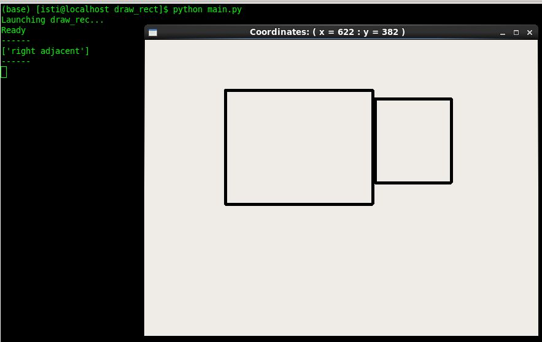
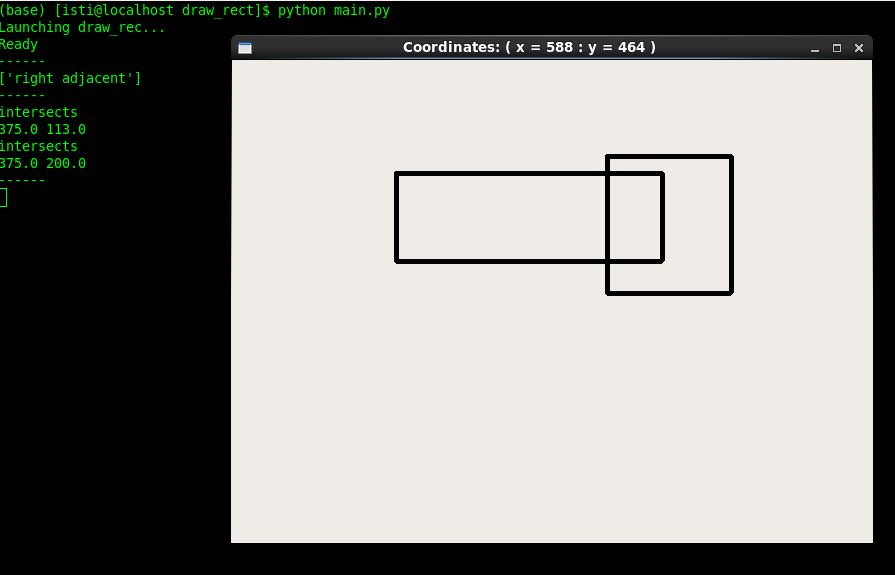
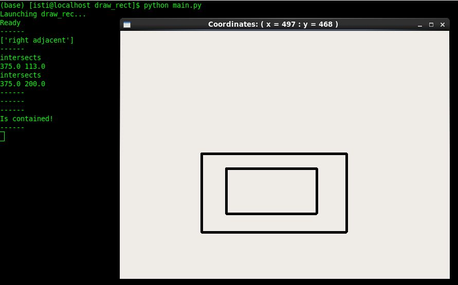

# Draw Rect Exercise
Jeffrey Leifer 2019-10-06 v1.0  [License](LICENSE.md)


### Table of Contents:
##### [-Overview-](#overview) 
##### [-Build-](#build) 
##### [-Usage-](#usage) 
##### [-Files-](#files)


## Overview
---
[Qt for Python](https://www.qt.io/qt-for-python) based GUI to draw two rectangles

Includes supporting code to determine the following:
   -  Is Adjacent
      - Does the two rectangles share a common side?
      - Is conditional that one rectangle is not inside the other
   -  Is Contained
      - Is one rectangle fully within the other?
  -  Intersection
      - Do any of the sides for the two rectangles intersect?
      - What are the intersection points?
     
Mouse tracking displays the xy position of the mouse on the widget header 

## Build 
---
### Install python3 PySide2
- Running the software requires Python3 and the PySide2 module 
- Below is the install process using Anaconda3 on a CentOS Linux operating system
```
#Download anaconda3
   wget https://repo.anaconda.com/archive/Anaconda3-2019.07-Linux-x86_64.sh
#Make install script executable 
   chmod a+x Anaconda3-2019.07-Linux-x86_64.sh
#Run install script using defaults
   ./Anaconda3-2019.07-Linux-x86_64.sh
#Create environment (optional)
   conda create --name draw_rect
   conda activate draw_rect
#Add conda-forge channels
   conda config --add channels conda-forge
#Install PySide2
   conda install pyside2 
````

## Usage
---
 Run the GUI 
 ```
 python main.py
 ```
 Run unit tests
 ```
 python unittests.py
 ```
 
 - Draw rectangles using the mouse and holding the left mouse button
 - Only two rectangles can be drawn at one time
    - Once a new rectangle is created, the oldest rectangle is destroyed
    
##### Examples    







## Files
---
##### main.py
  - Driver for GUI
  - Create RectangleCreator object
##### rect_creator.py
  - Qt based GUI to draw rectangles
  - Creates Rectangle objects
  - Runs isAdjacent, isContained and isIntersect draw_utils routines
##### draw_utils.py
  - Routines to check if two rectangles are:
    - Adjacent
    - Contained
    - Intersect
##### rectangle.py
 - Rectangle object extended from the [QRect](https://doc-snapshots.qt.io/qtforpython/PySide2/QtCore/QRect.html) Qt class
 - Helper functions to change rectangle orientation
##### constants.py
 - Constant variables for the project
##### unittests.py
 - Project unit tests

---
